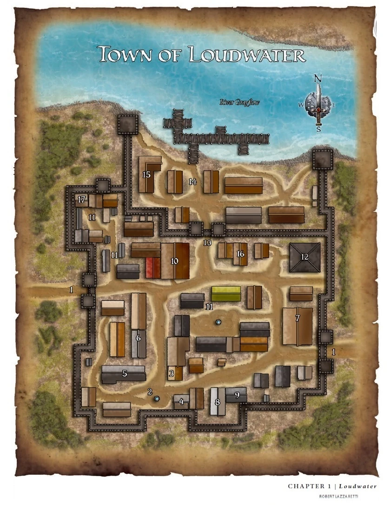

# Loudwater

**Population: ~4000**

**Main Language: Elvish**

**Loudwater** was a city that sat not far from the confluence of the Delimbyr and Gallow rivers. It was a picturesque garden city home to a pleasant and thriving cosmopolitan community of humans, elves, dwarves, and many other races. The town was named after the large, cascading waterfall that ran over the edge of the cliff nearby the original city called the Shining Falls. 

The town itself was a walled city, the stone walls of the original city around 40ft high and made of dark granite mined from the nearby cliffs. The population itself spreads out from around the city, building away from the cliffs and along the rivers that meet nearby. 

As recorded in their own histories, two elven houses established themselves here as they built a school of philosophy, which they named the **Velti'Enorethal.** It was the premier place on the continent for philosophical learning, rivalling the schools in [Commorragh](../Nidum/Commorragh%201b0c7339ad0580e397efceddadd80797.md). 

The great dwarf craftsman Iirikos Stoneshoulder and his team of dwarves built an ornate bridge across the Delimbiyr River at this site for some elven friends. 

<aside>
💡

In addition, it was widely rumoured that Iirikos built a great subterranean dwarven complex, which was accessed via caves behind [Shining Falls](https://forgottenrealms.fandom.com/wiki/Shining_Falls) - the Royal Caverns of Splendarrmornn, tombs dedicated to legendary elven and dwarven rulers from the times beforehand. This has still not been found to this day. 

</aside>

The town is currently overseen by **Maven Moonwillow of [The Moonwillows](../../Non%20Player%20Characters%20(NPCs)/The%20Moonwillows%201dac7339ad05804eba66c4a1cafb6365.md).** They have been the main representative for over 100 years as of 333AC

## Heraldry

Loudwater's symbol was composed of two golden crescent moons, one above the other, with a droplet of water to the right of the two crescent moons

## Underworld

Loudwater's small criminal underworld was controlled by a crime lord known only as the Lady of Shadows. Criminals who didn't pledge their loyalty to the Lady were discovered decapitated outside the walls and some in the Loudwater Patrol were bribed to turn a blind eye to her activities.

## Trade & Daily Life

Loudwater enjoyed both fertile farmland and a key location for commerce, allowing it to both flourish and prosper. Its success spread to the rest of the nearby area, helping it grow into a local center of trade. 

The local people made a living through farming and fishing, as well as by providing services to caravans. They often ate [szorp](https://forgottenrealms.fandom.com/wiki/Szorp), a trout variety fish caught in the Delimbiyr. The Loudwater Vale region was known for making the richest cheese in the region, known as the translucent [mist cheese](https://forgottenrealms.fandom.com/wiki/Mist_cheese). These cheeses were ripened in local caves. Hardwoods were also produced in the area.

## Description

It was a splendidly picturesque garden town, with every spare patch of ground and any available surface adorned by lovingly tended greenery and gardens and with bowers to be found all over. The wood-and-stone buildings - of all shapes and sizes, no two of which alike - were overgrown with vines and decorated with flowers and hanging plants, with plants both inside and on the roofs. Even the streets were planted with vines and moss (though it wore down to bare dirt on busy routes), and they curved and meandered to provide a good view or an interesting route. Giant ancient trees lined the green grassy banks of the river as you walked into town. 

Moreover, Loudwater was famed for its many grottos, so much so it was called the City of Grottos. These small caves and hollows between the hills were believed to be sacred to the city, and the elf sages of Velti'Enorethal argued they were living incarnations of the soul of the city, though such elven spiritualism was not widely shared. In any case, it was not unknown for people who disrupted these grottos to be afflicted with odd curses. Many of these grottos were oft-used and much-loved by locals, but a few had grim histories and were linked with dark emotions.

Thanks to the bridge, Loudwater spread out on both sides of the Delimbiyr. Thanks to the bridge, Loudwater spread out on both sides of the Delimbiyr. In layout, the city was shaped roughly like a boot, with the toe pointed east, the main foot lying on the south-eastern bank of the Delimbiyr and the ankle and leg stretching over the river to the north-western bank. Hence, the larger and most built-up part of the city lay on the south-east side and the smaller, less-built-up, and more wooded area lay in the north, with most buildings around the northern end of the bridge, where the road split in three branches, running northeast, north-northwest, and curving west. North of the river was known locally as High Town, or to some, Elf Town. The land here was craggy highlands, creating winding streets and a natural-seeming layout. The High Town was home to more sedate taverns, some of the guild halls, the elven houses at the northernmost side, and most notably the Representative’s Hall standing in the heart of Loudwater above where the falls crash down into the sea. South of the river was called Low Town, though the city's elves called it something in Elven that translated generously to "ugly town", though it was much cleaner and greener than many other cities. Naturally, it was predominantly human and held the noisier taverns, workshops, warehouses, merchants, and trade costers. To the south, an area running parallel to the river was called the Highbank. The only real ugly things in town were those left bare by practicality: four warehouses by the harbor and the cooperworks beside them.

2 miles southeast of the city, further along the cliffs, were the Pits of the Dead, mass graves wherein people who had died with no known burial plans, due to a plague that wracked the area a couple of hundred years ago. The graves were consecrated by a travelling cleric shortly after the plague eased up. 

---

Not shown to players - picture below. This can be the ‘old town’. only used as inspiration.

Notable NPCs:

- [Nayla Moonwillow](../../Non%20Player%20Characters%20(NPCs)/Nayla%20Moonwillow%201dac7339ad05804ca25ce08bd6546b7c.md) - Whereabouts currently unknown
- [The Moonwillows](../../Non%20Player%20Characters%20(NPCs)/The%20Moonwillows%201dac7339ad05804eba66c4a1cafb6365.md), the current ‘representatives’