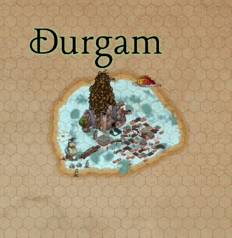

# Durgam

## **The Jade Orchid on the Azure Bloom**

(Durgam means untameable/impassable in Sanskrit - fitting for one of the main cities near the freedom nexus)

### prompt for durgam

Generate me a description of a fantasy town in a way that would be useful for a dnd 5e dungeon master. Take into account the following information:

- The town is called Durgam
- It is a city partly floating on the water, attached to a large green ‘hill’ that protrudes from the sea nearby. The protrusion is called the **Hua Shan.**
- Its architecture should be loosely inspired byChinese and Japanese architecture and feudal history, where the city itself has grown around the Hua Shan. It should also be inspired architecturally by the maldives floating city and venice. draw from these histories when describing the city, buildings, streets and everything that goes along with it.
- include three small factions that are vying for power in the city. One is magical, one is a thieves/rogues guild, and the third should be a monk’s guild.
- Generate a description and a ship name for an NPC called **Eight Stars Dancing,** a tabaxi ship captain who is down on his luck due to his ship being damaged and needing repairs.
- Generate points of interest that include the following:
- A thieves guild/hideout, and a head NPC that goes along with this called Spiju Niro
- Include some important points of interest underwater
- Include some information and a small daily gold cost for waterbreathing, and where this can be accessed in the city
- Picture
    
    
    

---

**Population: ~10000**

Imagine a vibrant tapestry woven upon the cerulean canvas of the sea. Rising majestically from the depths is Hua Shan, a verdant, steep-sided hill that seems to bloom from the ocean itself. Clinging to its lower slopes and extending outwards onto a network of interconnected docks, stilts, and floating platforms is Durgam. The city appears as a cluster of elegant structures, their curved tile roofs and intricately carved wooden and stone facades.

The city bustles with people of all walks of life - from humans, tieflings and halflings to orc, goliath and drow. A place for the exiled, the free, and the different - and a city full of danger and potential. 

**Architecture and Layout:**

- **The Hua Shan Embrace:** The lower reaches of the Hua Shan are terraced with gardens, small shrines, and the more traditional, earth-bound homes and businesses. Stone pathways wind upwards, punctuated by archways adorned with colorful banners bearing stylized crests.
- **Floating Districts:** Extending from the base of the Hua Shan are a series of interconnected wooden platforms and stone stilts, forming the bulk of the city. Canals crisscross these districts, navigated by flat-bottomed boats and gondola-like vessels adorned with lanterns.
- **Bridges and Walkways:** Ornate arched bridges, some crafted from polished wood and others from intricately carved stone, connect the floating sections. Covered walkways, offer shelter from the elements and house small shops and tea houses.
- **Materials and Aesthetics:** Buildings are primarily constructed from dark, lacquered wood with sweeping, tiled roofs often adorned with mythical creatures. Brightly coloured paper lanterns sway gently in the sea breeze, and the air hums with the sounds of splashing water, distant gongs, and the chatter of merchants. The impression is one of delicate beauty and harmonious integration with the surrounding water.
- **Underwater Foundations:** The city's stability relies on a network of carefully placed stone pillars and reinforced stilts that descend into the shallow waters surrounding the Hua Shan. Some older sections of the city even incorporate submerged ruins or naturally occurring rock formations into their foundations.
- **Old City:** The original city of Durgam was built up upon the outcroppings of Hua Shan - and was made entirely of stone, and entirely above ground. The city was part of the island - called Chult - with the original human/goblin/goliath/tiefling settlers called Chultans.

---

### **Streets and Canals:**

- **Waterways as Thoroughfares:** The canals are the lifeblood of Durgam, bustling with small boats carrying goods and people. The gentle lapping of water against the wooden supports is a constant sound.
- **Elevated Walkways:** Above some of the wider canals, covered walkways offer pedestrian routes, providing views of the bustling waterways below and the verdant slopes of the Hua Shan.
- **Lantern-Lit Alleys:** Narrow alleyways between buildings, often accessible by small stone steps leading down from the main walkways, are dimly lit by hanging lanterns and hold hidden workshops, quiet residences, and perhaps less reputable establishments.

---

**Factions Vying for Power:**

- **The Order of the Azure Current:** This magical faction draws its power from the unique energies that flow between the Hua Shan and the surrounding sea. Their headquarters is the **Tidal Spire**, a pagoda-like structure that appears to gently sway even on calm days, located on one of the larger floating platforms closest to the Hua Shan. They believe in maintaining the balance between the land and the water and see themselves as the guardians of Durgam's unique environment. Their leader is **Master** `Heikō` ****, a serene human with bright blue, deep-set eyes that seem to hold the depths of the ocean. They often use water magic and possess knowledge of ancient sea rituals.
- **The Ivory Throne:** A bandit group of the same name led by an Orc called [Dohma Raskovar](../Non%20Player%20Characters%20(NPCs)/Dohma%20Raskovar%201efc7339ad0580ae9c60f2f7f395a7ab.md), The ivory throne are a group in the city who are dangerous - and currently at war with the

---

**Points of Interest:**

- **The Sunken Market (Underwater):** Located amidst a cluster of ancient, partially submerged ruins near the base of the Hua Shan, this area is rumoured to be a haven for unusual aquatic creatures and perhaps even forgotten treasures. Visibility can be limited, and the market is known for being fairly dangerous - often robbers of theives will try their luck stealing things from here.
    
    *Shops include:*
    
    ### *The Gilled Scroll (magic store)*
    
    - **Owner**: **Mazu-Yan**, a tortle diviner with a watery, croaking voice and a penchant for soaking scrolls in brine for "luck."
    - **Description**: This slightly glowing shop rests beneath the waterline in the **Sunken Market**, accessible only to those with waterbreathing or a guide. Coral-encrusted shelves hold waterproof scroll tubes, pearl-inlaid wands, and barnacle-covered spellbooks. The faint hum of enchantment magic surrounds the space, and a monitor lizard sits lazily in an air filled tank that doubles as a sales counter.
        
        **Inventory Highlights**:
        
        - *Scroll of Control Water* (rare)
        - *Wand of the Tidelord* (uncommon; casts *shape water*, *create/destroy water*)
        - *Charm of the Deep Listener* (trinket; grants ability to speak with aquatic beasts 1/day)
        - *Waterlogged Tome* (common spellbook, but some spells unreadable until dried with magic)
    - 
    - **Pearlshine Pawn** – A pawn and trade store, where sailors pawn magical odds and ends; run by a sahuagin exile called **Yirkt** with surprisingly fair trade practices.
    - **Shell & Scale Clothiers** – Aquatic fashion and enchanted clothing that works underwater and on land; run by sea elf designer **Varen** **Virei**.
- **The Coral Gardens (Underwater):** A vibrant and colourful ecosystem teeming with exotic fish and strange flora. Some rare alchemical ingredients and perhaps even guarded resources might be found here.
- **The Shadowed Grotto (Underwater):** A network of dark and twisting underwater caves, rumoured to be connected to the Shadow Koi Guild's hideouts. Dangerous creatures and hidden passages are likely. The shadowed grotto eventually leads to the underdark.
- **The Whispering Falls Monastery (Hua Shan):** A serene sanctuary offering training in martial arts, meditation, and perhaps ancient lore related to the Hua Shan and the sea. Visitors are usually welcome, provided they show respect.
- **The Tidal Spire (Floating District):** The headquarters of the Order of the Azure Current. Outsiders are often viewed with polite curiosity, but access to the higher levels is restricted to members and those they deem worthy. The building itself looks like a large, lopsided stone building carefully carved out of marble and painted with shades of blue - to purposely look like a large wave coming out directly from the stone behind it.
- **Executioner’s Run:** The road through the Old City splits around a rectangular, stone-lined pit 15 feet deep, 50 feet wide, and 200 feet long, located just round the corner from the Drunken Barnacle. The original residents built it as an arena for a highly competitive ball game, and although that game is no longer played, it still provides cheap entertainment for the locals. Velociraptors, panthers, or other hungry beasts are set loose in the pit, then “convicted” criminals are dropped in at one end. Any criminals who make it alive through the gauntlet of carnivores to the far end of the pit can scramble up knotted ropes and win their freedom, along with the adulation of the crowd. Spectators line the walls for these spectacles. Bets are placed on which people will survive, which will die, how far runners will get before a beast brings them down, and how many kills each animal will rack up.
    - A handful of locals have become celebrities by surviving multiple dashes through Executioner's Run. It's been suggested that some people continue committing crimes solely because a conviction is the only way to get tossed into the pit, and betting is always heaviest on a repeat offender.
    - Occasionally an animal manages to leap or scramble out of the pit and runs amok through the terrified crowd. Moments of such high peril provide a perfect opportunity for bystanders to become heroes in the city and earn favours from the merchant princes.
- **Spiju Niro's Den (Thieves Guild Hideout):** See [Spiju Niro](../Non%20Player%20Characters%20(NPCs)/Spiju%20Niro%201dac7339ad0580e38544ef026c7fa4c9.md)
- [The Drunken Barnacle](The%20Drunken%20Barnacle%201dac7339ad058049b878e58b5488b06c.md) - The largest and busiest tavern in the city
- The [Misty Kettle](Misty%20Kettle%201efc7339ad058064bd4cdd85f39a0f26.md), a popular tea house
- [The Hanging Tree](The%20Hanging%20Tree%201efc7339ad0580f192b6d9934be180e3.md), the tavern on the middle tier of Hua Shan that houses
- [The Drowned Arena](The%20Drowned%20Arena%201efc7339ad05800496dfcc794758575f.md)
- [The Inkpot](Durgam/The%20Inkpot%201efc7339ad05806d9b3acd5982c2b282.md)

---

**Waterbreathing:**

- **Access:** Waterbreathing magic can be accessed in Durgam primarily through the **Order of the Azure Current** at the Tidal Spire. Some of their more experienced members can cast the necessary spells or create temporary potions.
- **Cost:** The daily cost for a waterbreathing potion or the casting of a waterbreathing spell is typically **5 gold pieces per person**. The Order justifies this cost as a contribution to the maintenance of the city's harmony with the sea and a safeguard against those who might misuse the ability for nefarious purposes. They may offer discounts or services in exchange for favors or assistance with their own goals.

---