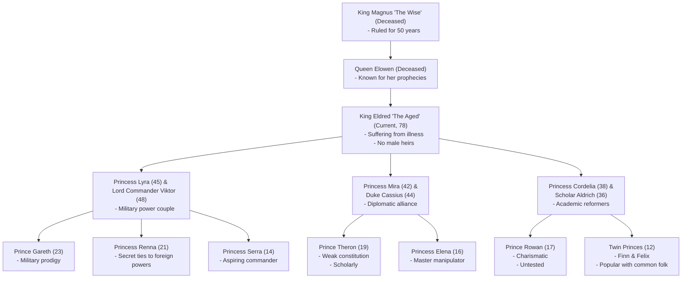
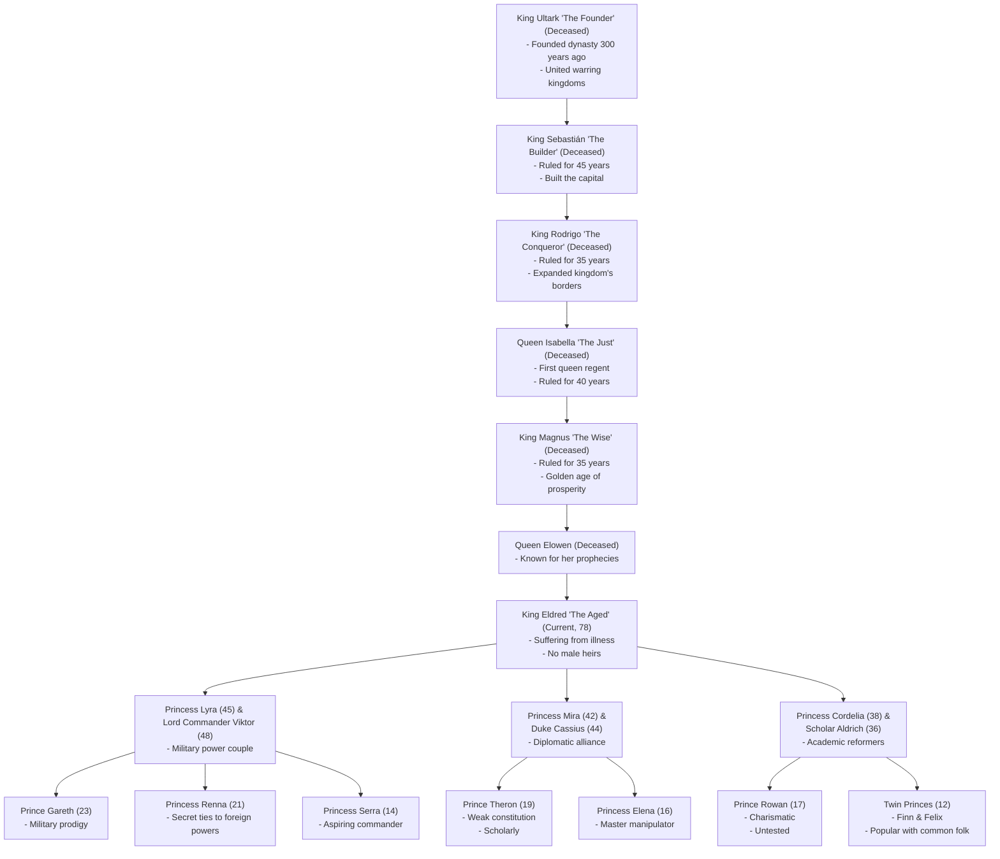

# The Varian Dynasty:

## Current Dynasty Members

### The King

**King Eldred 'The Aged'** (78)
Current ruler of the Varian Dynasty, known for his cautious and traditional approach to governance. His prolonged illness has sparked intense debate about succession, especially given the lack of male heirs. Despite his weakening health, he maintains a sharp mind and continues to play the various factions against each other. Eldred controls the area directly around the Capital city, Hawksreach. 

### First Branch - The Military Line

**Princess Lyra and Lord Commander Viktor** (45 & 48)
The eldest daughter and her militant husband control the kingdom's military forces. Lyra inherited her grandfather Magnus's strategic mind, while Viktor's decades of battlefield experience make them a formidable pair. Their marriage united the crown with military might, though some whisper this makes them too powerful.

**Prince Gareth** (23)
Military prodigy trained from birth by both parents. Already a decorated commander, he combines his mother's tactical genius with his father's battlefield prowess. His position as eldest grandson makes him a strong contender for the throne.

**Princess Renna** (21)
The mysterious middle child of Lyra and Viktor, known for her extensive network of foreign contacts. Her diplomatic connections worry many at court, who fear she might invite foreign intervention in succession matters.

**Princess Serra** (14)
Youngest of Lyra's children, already showing remarkable military aptitude. Her youth doesn't diminish her ambition to follow in her parents' footsteps, though this creates tension with her older brother Gareth.

### Second Branch - The Diplomatic Line

**Princess Mira and Duke Cassius** (42 & 44)
The middle daughter's marriage to Duke Cassius created a powerful alliance with the old nobility. They excel in court politics and maintain an extensive network of noble allies.

**Prince Theron** (19)
Despite his weak constitution, Theron's scholarly nature and keen intellect make him a different kind of leader. Some see his physical weakness as a disadvantage, while others appreciate his thoughtful approach to governance.

**Princess Elena** (16)
A master of court intrigue despite her young age. Elena learned well from her parents' diplomatic mastery and has built her own network of informants and allies.

### Third Branch - The Academic Line

**Princess Cordelia and Scholar Aldrich** (38 & 36)
The youngest daughter's controversial marriage to a common-born scholar marked a shift in dynasty traditions. Together they champion educational reforms and modernization of the kingdom.

**Prince Rowan** (17)
Charismatic and popular, but untested in real leadership. His father's academic influence shows in his progressive ideas, though some doubt his ability to implement them.

**Princes Finn and Felix** (12)
The twin princes charm both nobles and commoners alike. Their youth and innocence make them popular with the people, though this also makes them potential pawns in court politics.

## Extended Dynasty History

### First Generation - The Founding

**King** Ultark **'The Founder'**
The first Varian king who united the warring kingdoms through a combination of military prowess and diplomatic genius. His fifteen-year campaign to unite the realm established the dynasty's legitimacy and created the foundation of the current kingdom. Known for his legendary sword "Kingmaker" which became a dynasty symbol.

### Second Generation - The Building

**King Sebastian 'The Builder'**
Son of Matthias, ruled for 45 years. His reign focused on consolidating power and establishing infrastructure. Built the capital city of Hawksreach and established the major institutions of governance. His architectural achievements remain the dynasty's most visible legacy.

### Third Generation - The Expansion

**King Aldric 'The Conqueror'**
Grandson of Matthias, ruled for 35 years. Expanded the kingdom's borders to their current extent through military campaigns and strategic marriages. Established the traditional military culture that still influences the dynasty, particularly evident in the current generation's Princess Lyra and Prince Gareth.

### Fourth Generation - The First Queen

**Queen Isabella 'The Just'**
First queen regent of the dynasty, ruled for 40 years. Daughter of Aldric, she took the throne when her brothers died in battle. Her reign marked a shift toward diplomatic solutions and internal development. Established the laws of succession that now complicate King Eldred's situation. Known for her fair judgments and the establishment of the Royal Court system.

## Timeline

**0 AC:** The Comet appears, marking the beginning of the modern calendar.

**8 AC:** Ultark the Unifier begins his campaign to unite the scattered villages and towns of what would become Ilkazan.

**18-33 AC:** The Wars of Unification. Ultark systematically conquers and incorporates scattered settlements, establishing the foundations of Ilkazan.

**20 AC:** Battle of Three Rivers - Ultark's forces defeat a coalition of seven village-states in a decisive victory.

**33-48 AC:** Ultark 'The Founder' establishes the Varian Dynasty after unifying the realm. (15-year reign).

**48-93 AC:** King Sebastian 'The Builder' rules for 45 years, establishing major infrastructure and the capital city.

**71-74 AC:** First Shadowspawn War. Southern settlements fall initially, but Ilkazan forces eventually triumph at the Battle of the Blighted Pass.

**85-86 AC:** The Miners' Rebellion - A significant uprising occurs when mining guilds protest against harsh working conditions. Sebastian responds by implementing worker protection laws and establishing the Engineers' Exchange to improve mining safety.

**93-128 AC:** King Aldric 'The Conqueror' rules for 35 years, expanding the kingdom's borders through military campaigns. He also was credited with organising the southern boarder with the Spawnlands, making the country more resilient to these incursions.

**99-101 AC:** Second Shadowspawn War.

**128-168 AC:** Queen Isabella 'The Just' rules for 40 years, establishing the laws of succession and the Royal Court system.

**146-148 AC:** Third Shadowspawn War. This war was one of the most dangerous, as a new type of creature - charged with necrotic light - took defenders by surprise. The country was saved only by the intervention of giant Corvids, who made an alliance with Isabella.

**168-218 AC:** King Magnus 'The Wise' rules for 50 years, ushering in a golden age of prosperity

**210-211 AC:** Fourth Shadowspawn War - Notable for being shorter than previous conflicts, demonstrating Ilkazan's improved military capabilities.

**218-245 AC:** Period of Queen Elowen's influence and prophecies.

**245-Present (333 AC):** King Eldred 'The Aged' rules, facing succession challenges with three daughters.

**~333 AC (Present Day):** Ilkazan faces potential succession challenges with the king's three daughters serving as regional administrators. The nation maintains its position as an agricultural and economic power while remaining vigilant against Shadowspawn threats.

.

## 

## Potential Plot Hooks

1. Ancient Prophecy: Queen Elowen's prophecies about the future of the dynasty could resurface, affecting current succession claims.
2. Succession Crisis: With King Eldred ill and no male heirs, conflict could arise between the three princesses and their powerful spouses over their claim to the throne.
3. Military Power Couple: Princess Lyra and Lord Commander Viktor's combined military influence could lead to armed takeover attempts.
4. Diplomatic Web: Duke Cassius's noble connections through Princess Mira create a complex network of alliances and obligations.
5. Academic Revolution: Scholar Aldrich's radical ideas combined with Princess Cordelia's reformist agenda threaten traditional power structures.
6. Twin Intrigue: The young twin princes could become pawns in various factions' schemes, despite their popularity.
7. Generational Divide: The large age gaps between siblings (Serra at 14 vs Gareth at 23) create different perspectives and loyalties.
8. Princess Elena's Schemes: The young but cunning princess could be manipulating events behind the scenes.
9. Legacy of Magnus: The shadow of the great King Magnus's reign influences current political expectations and standards.
10. Military Rivalry: Tension between Princess Serra's ambitions and her older brother Gareth's established position.
11. Foreign Intrigue: Princess Renna's secret foreign ties could introduce international complications or potential external interference in succession.
12. Class Conflict: The various marriages have created different class alliances, from military to academic to noble, splitting society.