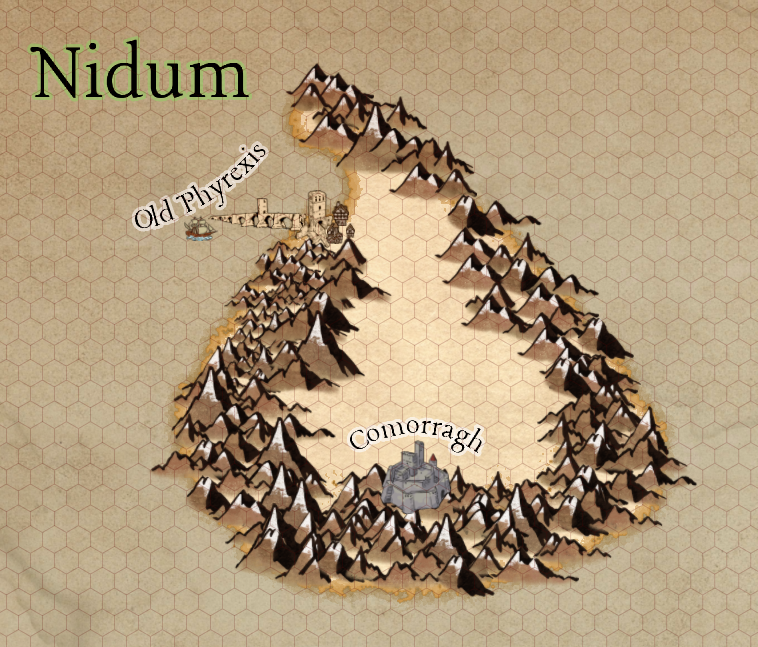

# Nidum

## The Magocratic Bastion of Civilization

Nidum is the oldest of the four countries in Proeli. It is led by [The Hand](../Non%20Player%20Characters%20(NPCs)/The%20Hand%201e4c7339ad0580ee9b9fedd056cbf408.md), Five creatures at the pinnacle of magical ability, who uphold the values and virtues of the nation.

Nidum is sometimes known the “Bastion of Civilization”, the oldest recorded settlement on Proeli as it was the first place settled by humanoids.

Population: **~**70,000

- 20,000 in the capital city, [Commorragh](Nidum/Commorragh%201b0c7339ad0580e397efceddadd80797.md)
- 35,000 around the plains in the centre of the island, in miscellaneous towns (including 10,000 in [Y`antram`](Nidum/Yantram%201dac7339ad0580eea254d6340f9f64cf.md) and the surrounding villages)
- 10,000 in [Old Phyrexis](Nidum/Old%20Phyrexis%201e4c7339ad05808c9132efa89e9b4c5f.md), the port city at the north west of the island
- 5,000 in [*Gravenhollow's Lock*](Nidum/Gravenhollow's%20Lock%201e4c7339ad0580a2bdc9d65f244ae745.md), a city deep beneath the mountain range below Comorragh

Capital city: [Commorragh](Nidum/Commorragh%201b0c7339ad0580e397efceddadd80797.md) 

Common races: Dragonborn, dwarves, Aasimar, Tieflings, goliath, humans

Main Language: Draconic

Other languages: 

- Some Celestial
- Some Giant
- Some Orcish (for trade)

Exports: 

- Magic items (spell scrolls, enchanted items, potions)
- crops (potatoes, rye, beets, turnips, onions, other hardy vegetables)
- Rare herbs or ingredients from rare creatures

Nidum has four large main ‘cities’:

[Old Phyrexis](Nidum/Old%20Phyrexis%201e4c7339ad05808c9132efa89e9b4c5f.md)

[Commorragh](Nidum/Commorragh%201b0c7339ad0580e397efceddadd80797.md)

[Y`antram`](Nidum/Yantram%201dac7339ad0580eea254d6340f9f64cf.md)

[*Gravenhollow's Lock*](Nidum/Gravenhollow's%20Lock%201e4c7339ad0580a2bdc9d65f244ae745.md)

---

### [Old Phyrexis](Nidum/Old%20Phyrexis%201e4c7339ad05808c9132efa89e9b4c5f.md)

The port town at the north west of Nidum, Old Phyrexis is a small but busy port surrounded by sandy soil. Most of the food dishes consist of fish, beets, radishes and potatoes. 

---

### [Y`antram`](Nidum/Yantram%201dac7339ad0580eea254d6340f9f64cf.md)

Yantram is the ‘nexus’ city near the centre of the plains of Nidum. Mostly known to be a trade hub, it is not known for being particularly eventful, but is often a resting point for those travelling to Comorroagh via land. 

---

### [Commorragh](Nidum/Commorragh%201b0c7339ad0580e397efceddadd80797.md)

Capital City of the Magocracy of [Nidum](Nidum%2019dc7339ad0580caa4e3c9f4df3b360a.md), Comorragh is located high in the Ephyran mountains - a mountain range that spans the majority of the island of Nidum. 

A sprawling, busy city, Comorragh is built upon a large rocky plateau held up by a large stone statue of a humanoid, known as **Reoth,** holding the city up upon its shoulders. There is a metal platform that moves people and items from the base of the statue to the city proper.

---

### [*Gravenhollow's Lock*](Nidum/Gravenhollow's%20Lock%201e4c7339ad0580a2bdc9d65f244ae745.md)

Gravenhollow’s Lock is a heavily fortified underground city built atop a massive chasm known as the Yawning Abyss from which dangerous creatures rise. The city’s primary function is to serve as a watch post ****to protect the rest of Nidum, as well as a place that the martial or magically exceptional of Nidum can earn coin by hunting dangerous monsters.

---

## [The Hand](../Non%20Player%20Characters%20(NPCs)/The%20Hand%201e4c7339ad0580ee9b9fedd056cbf408.md)

The hand is the group that control and govern Nidum. The Hand always consists of five members. As of 333 AC, they are:

- [*Maglocunus*](../Non%20Player%20Characters%20(NPCs)/The%20Hand/Maglocunus%201f6c7339ad0580ebb251e4d026da765c.md), Blue dragonborn and **Caomhnóir** (head) of the Sacred Kells Library of Commorragh
- [Rhendron Stonespine](../Non%20Player%20Characters%20(NPCs)/The%20Hand/Rhendron%20Stonespine%201f6c7339ad058072a277cc48ba734587.md), Goliath Sorcerer and military general of Comorragh (Head of the [**Laoch Military School**](Nidum/Commorragh/Laoch%20Military%20School%2023dc7339ad05800790c5f47675f94e57.md))
- [Paige Jare](../Non%20Player%20Characters%20(NPCs)/The%20Hand/Paige%20Jare%201f6c7339ad0580bcb34efee3d37982df.md), a Hobgoblin Wizard and head of [Comorragh College](Nidum/Commorragh/Comorragh%20College%20227c7339ad058023b8e3de2e5d4c4918.md)
- [Tezzerret](../Non%20Player%20Characters%20(NPCs)/The%20Hand/Tezzerret%201f6c7339ad058046a2b6e5ba06ddb075.md), Human Artificer
- [**Quinn Thea**](../Non%20Player%20Characters%20(NPCs)/The%20Hand/Quinn%20Thea%201f6c7339ad0580398e39ec529a21355f.md), Aasimar Cleric and Head of the Church of the Weaver

## History of Nidum. All dates are “AC”, or “After Comet”

[Untitled](Nidum/Untitled%2023dc7339ad058088ae4fe24e5d2bd370.csv)